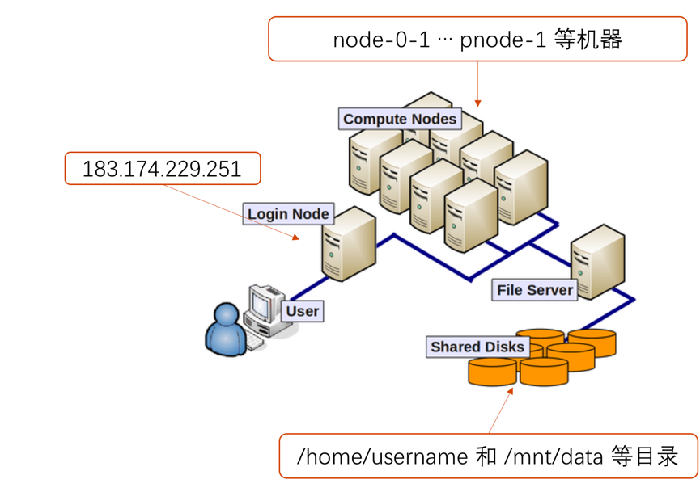
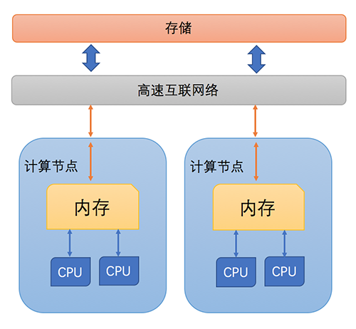
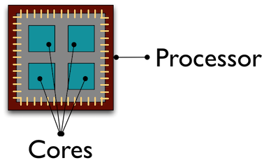

# 入门知识

## 高性能计算介绍

*图 集群拓扑结构图*

广义上来讲，一个高性能计算集群(High-Performance Computing Cluster)是由一组计算性能强劲的计算机通过高速网络连接后组成。集群中某单台计算机被称为节点（node）。高性能计算集群一般由登录节点、计算节点和存储节点组成。

其中，计算节点和存储节点不能被用户直接访问，需要用户先连接到登录节点，登录节点是连接整个集群的入口。人大集群的登录节点是IP为183.174.229.251的机器。计算节点，是提供计算服务的计算机节点。通常情况下，一个用户作业任务需要一台或多台计算节点来支持其计算服务。人大集群目前有名为node-0-1等55个计算节点。将某个计算作业任务分配到不同计算节点上进行计算的工具被称为**作业调度器**。计算作业一般需要读写文件，我们采用了**共享存储系统**，将存储节点的磁盘空间映射到所有计算节点上。共享存储系统使用户可以像操作个人计算机上的文件一样操作远程的存储节点上的文件。集群上的用户home目录和/mnt/data目录都是共享存储。

使用集群的一般步骤如下：

1. 选择所需要的编程语言或软件，了解该软件在集群上的加载和使用方法。准备源代码和数据。如需使用源代码编译执行的，使用相应编译工具进行编译。

2. 在调度系统中提交计算程序，提交的程序被称为作业，作业将被调度执行。

3. 查看作业状态，等待作业执行完成，查看输出结果。

!!! tip "从零到一"

    下面两个小教程以一个HPC小白用户为第一人称，模拟了用户使用HPC从零到一可能遇到的各种问题，可以你帮助快速了解HPC相关知识，我们非常推荐集群新用户先阅读这两个教程。

    教程由Carpentry提供，Carpentry是一个志愿者组织，它旨在开发编程课程，帮助不同科研领域的研究者学习使用计算服务。这两个教程中作业调度和文件系统部分与人大集群选择的技术方案不同，部分作业调度命令在人大集群上无法运行，你可以结合我们的人大集群教程相关部分一起学习。

    - [Introduction to High-Performance Computing][1]
    - [HPC in a day][2]

[1]: https://hpc-carpentry.github.io/hpc-intro/
[2]: https://psteinb.github.io/hpc-in-a-day/

## 术语解释

高性能计算或者科学计算领域经常使用一些术语，为了避免用户被各种名词和术语所混淆，这里给出一些常用术语的解释。

*图 集群架构示意图*

#### 节点 node

某台物理计算机被称为节点。计算节点是专门进行计算服务的单台计算机，一般配有处理性能强劲的CPU处理器。集群由众多计算节点组成，影响计算节点的关键是CPU和内存。多台计算节点通过高速网络（InfiniBand）相互连通。

#### CPU

中央处理器，英文全称Central Processing Unit，是计算机处理数据的核心单元。现代处理器通常具有多个核心。更多的核心意味着更强的并行计算能力。

人大集群上的普通节点使用的是Intel E5-2650 v4，共2个CPU，每个CPU 12个核心，即一个节点上有24个核心。胖节点使用的是Intel E5-4620 v3，共4个CPU，每个CPU 10个核心，即一个节点上有40个核心。

#### 内存和存储 memory storage

某一CPU某个时间点只能处理很少量的数据，程序所需其他数据会缓存在内存中，计算机断电后，这些内存中的数据会丢失。更多其他数据被持久存储在硬盘中，即使断电后，这些数据也不会丢失。集群中一般有由多块硬盘组成的存储设备，为集群提供数据存储支持。

#### 程序 program

程序能够被计算机CPU可执行。一般地，给定这个程序输入文件，经过程序的执行处理，会产生输出。从程序源代码到可执行，一般需要编译（如C++/Fortran）或解释（如Python）。

#### 软件 software

商业公司或开源社区编写的大型程序，被我们用来进行科学计算。例如分子模拟软件 amber。

#### 作业 job

作业的概念一般是从集群作业调度器的角度来讲的，在集群上，计算资源被分配到某个用户的某个程序上来执行，被称为启动作业。

#### 作业调度器 job scheduler

集群是一个共享的资源，每个计算节点就像共享单车一样，是可以被共享出来的。当有计算需求时会被调度器按照某种机制来分配计算资源。这样某个作业就会被分配到某一个或几个计算节点上运行。

#### 并行编程 parallel programming

并行程序利用现代计算机的多处理器多核心甚至多机器的特性，将一个计算任务分解为更小的子任务。先在每个核心上执子任务，然后将子任务输出汇总（reduce），得到主任务的结果。一般使用MPI和OpenMP来进行并行编程。并行编程可以加快问题求解速度，但不是所有任务都可以并行。推荐阅读张林波等人所著《并行计算导论》来学习并行编程和算法。
