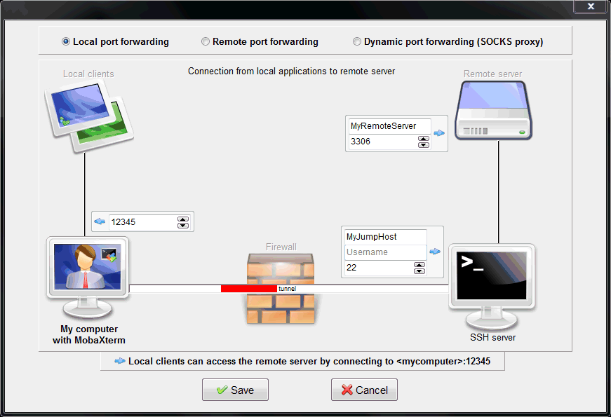

Jupyter Notebook可以允许在网页页面中直接编写代码和运行代码，得到运行结果，用户在网页界面中可以完成整个数据科学的工作流程，包括数据清理、统计建模、构建和训练机器学习模型、可视化数据等等。这种交互界面大大方便了研究人员进行数据科学的开发和调试。

由于用户只能访问集群的登录节点，集群上计算节点是无法被用户直接访问，而登录节点原则上不允许直接运行 Jupyter 等程序。因此，在集群上使用 Jupyter 要稍做一些修改。

1. 登录到计算节点node-0-1
2. 启动Jupyter
3. 建立SSH隧道
4. 在个人浏览器打开Jupyter界面

# 登录到计算节点 node-0-1

从登录节点ssh到集群计算节点 node-0-1，集群目前暂时只支持 node-0-1 使用 jupyter，如用户太多，计算需求无法被满足，可与我们联系，进行扩容。

```bash
ssh node-0-1
```

## 启动Jupyter

2. 在计算节点node-0-1上加载anaconda和相应python或r环境，使用命令启动Jupyter Notebook。

```bash
module load anaconda/5.3.0
source activate python36
jupyter notebook --no-browser --port=9030 --ip=node-0-1
```

!!! tip "IP和端口号"
    为避免端口号冲突，port要设置成9000~9999中的某个值。如这个端口被占用，系统会提示 `The port 9030 is already in use, trying another port.` 。请选择另外一个端口号尝试重启 Jupyter。启动成功后记住这个端口号。IP目前暂时只支持 node-0-1。

# 建立SSH隧道

SSH隧道的原理如图所示，我们为了访问原本无法访问的 node-0-1，需要建立一个隧道。刚刚启动Jupyter所用的端口号9030，即为Remote Server Port。



**Mac和Linux用户**

直接使用ssh命令

```bash
ssh -NL 9030:node-0-1:9030 linpack@183.174.229.251
```

记得这里为将9030修改为你刚才启动Jupyter的端口号。

**Windows用户**

MobaXterm 用户 可以在“Tools”下“MobaSSHTunnel (port forwarding)”中选择“New SSH Tunnel”，选择“Local port forwarding” 选项，在Remote Server处将端口号和服务器填写进去。然后启动这个SSH隧道。

# 在个人浏览器打开Jupyter界面

刚才启动Jupyter的时候，系统会返回一个登录的URL：

`http://node-0-1:9030/?token=a6f9113aef92aafaed458917ebcc43de5c77483572fdf484`

把URL中的node-0-1换成localhost即可，访问该URL即可使用Jupyter服务。

# 关闭Jupyter

不需要时，请在node-0-1的命令行使用`Control-C`及时关闭你的Jupyter服务。
